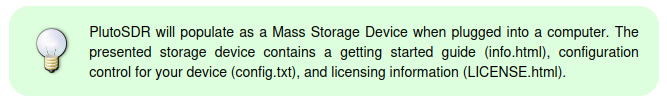
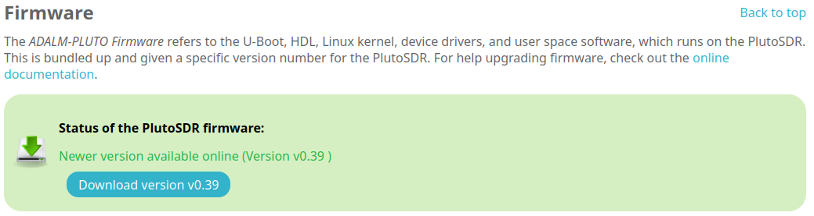

Adalm Pluto
=============
The Adalm Pluto is a very simple SDR to use and setup.
Analog Devices provides a very good tutorial.
Here is a link to it: `ADALM-PLUTO Overview [Analog Devices Wiki]`_.
This tutorial will highlight the key steps in their procedure.

Setup
-----------
Start by plugging in the PlutoSDR into your computer,
the box that the SDR came in should have with a cable.
Otherwise most micro USB cables will work.
From their wiki:

Opening the info.html file in the Pluto's storage device
will display the next set of instructions.
The page gives explanations the next steps, upgrading firmware,
installing libraries and testing the installation.

.. tip::
    Towards the bottom of the info.html page is additional information on the device
    such as model information and configuration settings.

Firmware
^^^^^^^^^^^^^^^^^^^^
To upgrade the firmware, use the info.html page to download
the latest version of the firmware. It will look like this:

Follow the link to the online documentation on upgrading firmware.
From that page:

1. download the package (a zip file labeled plutosdr-fw-v[version number].zip)
    - the firmware file is downloaded from the download link in info.html
2. copy the file into the pluto storage space
3. eject the drive

After the drive is ejected the PlutoSDR's LED1 will flash rapidly.
This indicates that the firmware is being updated.
The process takes about a minute and then the PlutoSDR will appear
again as a storage device. If successful the new info.html page will
display this under the firmware section:

The firmware is now up to date!

Install libiio
^^^^^^^^^^^^^^^^^^^^
The info.html site has the information for downloading libiio.
The download depends on the OS of the system, the file type to be downloaded
and the version. Select and download the appropiate version of the file.

For example if I am using Ubuntu 22.04 I would select Ubuntu for the OS.
Then I would select the file type, I find .deb files easy to use.
Finally I select Linux-Ubuntu-22.04 for the version and click the
link next to it. This will download the appropiate file for my system.

.. tip::
    If the options for Type and Version appear blank, select a different OS
    option and then select the original option again.

    Also if on Windows the correct OS option is setup.exe

Testing that Everything is Working
^^^^^^^^^^^^^^^^^^^^^^^^^^^^^^^^^^^^^^^^
Adalm Pluto provides simple commands for 

.. _ADALM-PLUTO Overview [Analog Devices Wiki]: https://wiki.analog.com/university/tools/pluto
