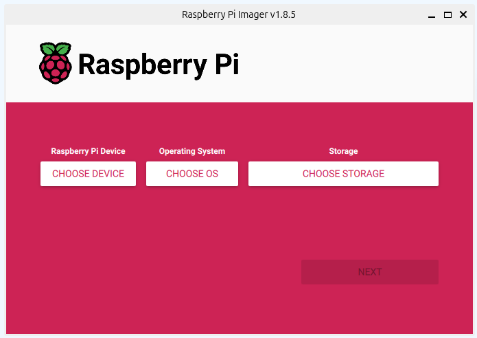
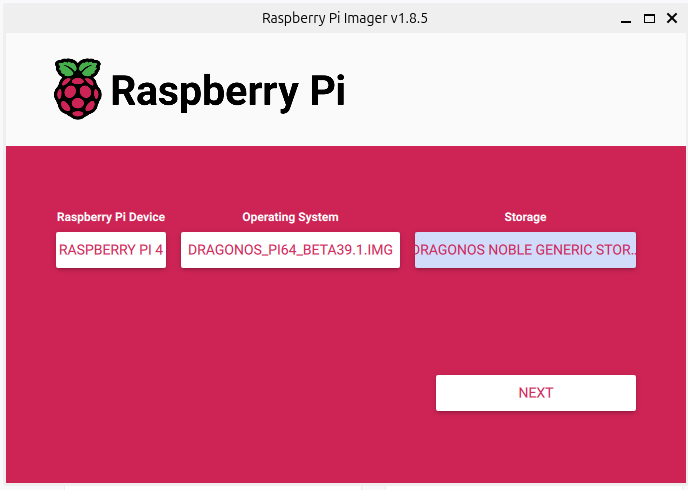
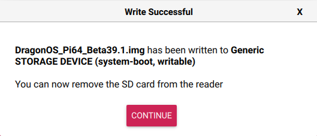

Raspberry Pi
==========================

Setting up a Raspberry Pi to use SDRs isn't much different than setting up
an SDR for Linux. However, there are a few OS's that are pre-built for
working with SDRs which saves a lot of hassle. Here are some pre-built OS
for working with SDRs.

- DragonOS_
    - Both standard OS and Raspberry Pi support
    - Basically Linux with pre-installed software for SDRs
- SigintOS_
    - Not designed for Raspberry Pi but an option for a standard OS
- PiSDR_
    - No longer under development

In this tutorial DragonOS will be installed onto a Raspberry Pi 4B.

Install DragonOS
-----------------------

First DragonOS will need to be flashed to a mirco SD card.
To begin the `Raspberry Pi Imager <https://www.raspberrypi.com/software/>`_ is needed to build the OS.
The Imager can be `downloaded from their website <https://www.raspberrypi.com/software/>`_.
Download the Imager_ and install it.
Once installed, the imager will look like this.

Download the latest version of DragonOS_.
It can be `downloaded on sourceforge <https://sourceforge.net/projects/dragonos-pi64/>`_.
The file is zipped using gz.
It can be unzipped with 3rd party software like 7-Zip.
If on linux it can be unzipped by running:

.. code-block:: console

    gzip -d filename.gz

Unzipping will take some time as the file is a few gigabytes.

Open the Raspberry Pi Imager and select the device to be used.
Under `Operating System` scroll down until `Use custom`.
Select the DragonOS file from the computers file system.
Then under `Storage` select a connected micro SD card.
It will look something like this when properly configured
(the storage device name may be different).

Selecting `Next` will bring a prompt to edit OS settings.
Under OS settings the hostname, login and Wifi and more can be customized.
It is recommended to change these from the defaults. Adding wifi information
will make it easier to connect to the Pi remotely later.
Once settings have been configured apply them in the dialog screen.
It will ask to confirm that all existing data will be erased.

The imager will then write begin writing to the micro SD card.
The process will take a few minutes but once it is done, it will display a
message like this.

.. note::

    If there is an error saying `Partition does not have a FAT file system`
    then you may be using the wrong file for DragonOS, ensure it is a .img
    for Raspberry Pi and not a .iso file.

With the OS installed and ready the Pi can be connected booted up.
Many programs built into DragonOS use GUIs so it is a good idea to
connect a screen, mouse and keyboard to the Pi.
If that isn't an option VNC is a good alternative as it gives
a screen, keyboard and mouse control through a network connection
(there are plenty of other options other than VNC).
There are plenty of good tutorials on setting up VNC (DragonOS comes with
RealVNC pre-installed).

.. note::

    If DragonOS does not work when booted up, try using a slightly older
    version of the OS. For example, in testing, DragonOS Beta39.1 did not load
    the login screen, using the older version, Beta37 worked.

The default username is `ubuntu` and the password is `dragon`.

.. _DragonOS: https://cemaxecuter.com/
.. _SigintOS: https://www.sigintos.com/sigintos-2-0-community-edition/
.. _PiSDR: https://github.com/luigifcruz/pisdr-image
.. _Imager: https://www.raspberrypi.com/software/
