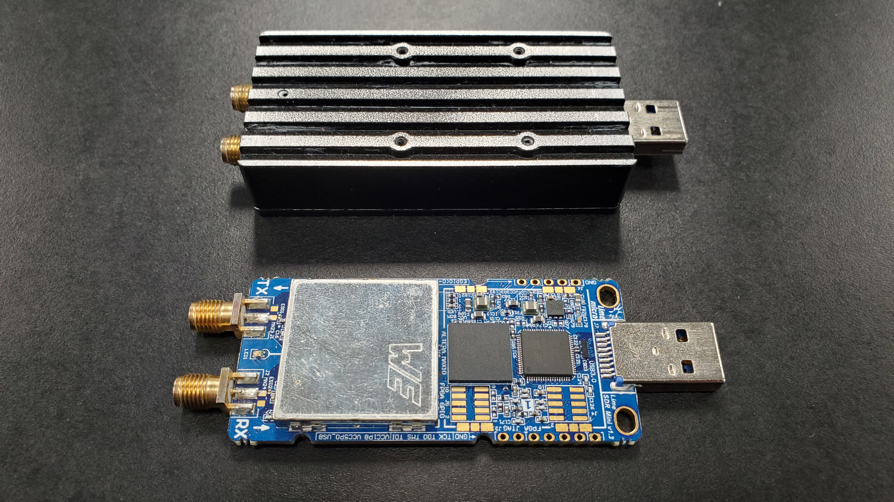
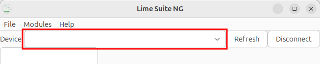
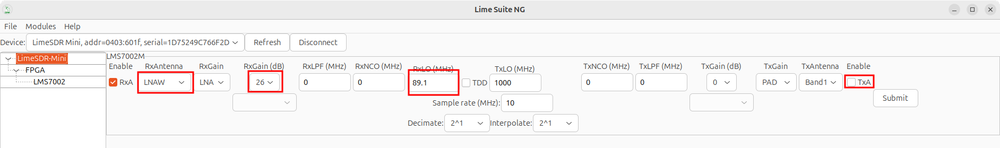
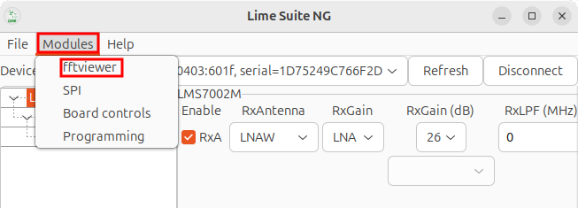
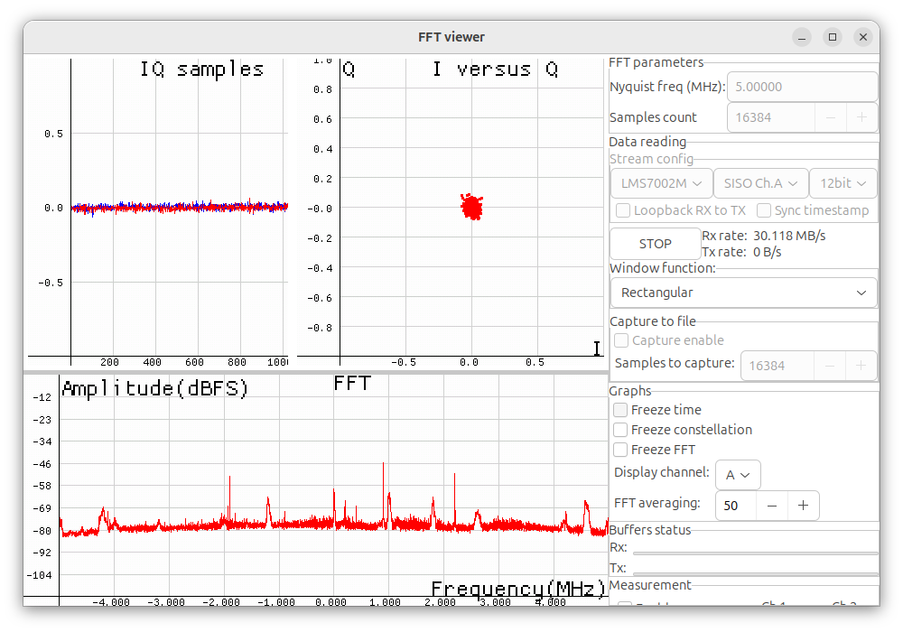

Lime Mini
==============

Hardware setup
--------------------
Connect the Lime mini to the computer through a USB port.

.. tip::
    Use of an ESD strap while handling the Lime mini is recommended
    to avoid damage to the device.

    Additionally, a connector saver/short extension cable will make
    it harder to damage the USB port.

Software setup
---------------------
The Lime mini utilizes Lime Suite for API and GUI access.
Either the Classic or Next Generation (NG) application can
be used assuming a compatible OS,
however information on use will be provided for the NG application.

NG
^^^^^^^^^^
Installation instructions can be found on the
`NG Github <https://github.com/myriadrf/LimeSuiteNG/tree/develop>`_.

`Installing wx <https://wxwidgets.org/downloads/>`_ and then installing LimeSuiteNG from source will allow use of the GUI.
(If installing for Linux, after downloading the source,
extract the files and in the new folder navigate to docs,
then gtk and open the install.md file for instructions).

Classic
^^^^^^^^^^^^^^
Installation instructions may be found on the
`Classic Github <https://wiki.myriadrf.org/Lime_Suite#Installation>`_.

Use
------------
Information about the tools can be found on the
`LimeSuite Github <https://limesuiteng.myriadrf.org/gettingstarted/>`_.

Installation comes with a set of tools allowing use of the SDR, these are

- limeDevice
- limeConfig
- limeTRX
- limeSPI
- limeFLASH

Running any of these with the :code:`-h` flag will provide more
information (e.g. :code:`limeConfig -h`).

If the GUI was installed, it can be run with the command :code:`limeGUI`.

Example - viewing radio frequency bands
---------------------------------------
An antenna supporting VHF and UHF was used for
this example (connect to the RX port).

Configuration
^^^^^^^^^^^^^
Command line option:

:code:`limeConfig --initialize --samplerate=20e6 --rxen=1 --rxlo=89.1e6 --rxgain=26 --rxpath=LNAW # rxlo=88e6-108e6`

Or using limeGUI (``limeGUI``):

1. Select the Lime mini from the devices dropdown.

2. Turn transmission off and select the following (leave all other settings unchanged):
    - RxAntenna: LNAW
    - RxGain (dB): 26 (this can be adjusted down or up as desired)
    - RxLO (MHz): 89.1 (or another frequency between 88 and 108 MHz)
    - Enable TxA: Uncheck

1. Press "Submit"

Viewing Frequencies
^^^^^^^^^^^^^^^^^^^
You can identify the highest frequency of a signal on the
command line with the command:

``limeTRX --fft``

In the GUI, you can do this by pressing modules and selecting the fftviewer.

Press start in the new window. The output should resemble the following:

