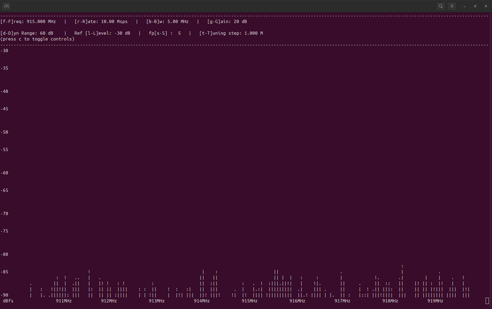

USRP B210
=================

The USRP B210 is a much higher end SDR.
It is much less user friendly than other SDRs.
This tutorial will aim to streamline the information provided on the
`USRP Manual <https://files.ettus.com/manual/page_build_guide.html>`_.
The tutorial is intended for a Linux system running Ubuntu, adjusting for
another OS would require viewing the Manual, however some steps are identical.

Installing Dependencies
----------------------------------

USRP devices require a set of dependencies, listed on their website.
They provide a command that should install all required dependencies.

.. code-block:: console

    sudo apt-get install autoconf automake build-essential ccache cmake cpufrequtils doxygen ethtool \
    g++ git inetutils-tools libboost-all-dev libncurses5 libncurses5-dev libusb-1.0-0 libusb-1.0-0-dev \
    libusb-dev python3-dev python3-mako python3-numpy python3-requests python3-scipy python3-setuptools \
    python3-ruamel.yaml

.. note::

    If on Ubuntu 24.04 then libncurses5 is no longer available.
    Running the following commands will install the packages correctly.

    .. code-block:: console

        wget http://archive.ubuntu.com/ubuntu/pool/universe/n/ncurses/libtinfo5_6.3-2_amd64.deb && sudo dpkg -i libtinfo5_6.3-2_amd64.deb && rm -f libtinfo5_6.3-2_amd64.deb

        wget http://archive.ubuntu.com/ubuntu/pool/universe/n/ncurses/libncurses5_6.3-2_amd64.deb && sudo dpkg -i libncurses5_6.3-2_amd64.deb && rm -f libncurses5_6.3-2_amd64.deb

        sudo apt install libncurses5 libncurses5-dev -y

With these commands the required dependencies should be installed.

Install Source Code
----------------------------------

Navigate to a new directory and clone the repository using:

.. code-block:: console

    git clone https://github.com/EttusResearch/uhd.git

By default it will be on the master branch which is the most up to date
version of the software. If a specific version is desired switching branches
will accomplish this (don't forget to navigate to the repo directory):

.. code-block:: console

    git checkout UHD-<version>

To build the file the Makefiles will need to be generated. Run the following:

.. code-block:: console

    cd <uhd-repo-path>/host
    mkdir build
    cd build
    cmake ../

.. note::

    The `USRP Manual`_
    gives additional direction into common bugs and install configurations.

Once the build files are generated they can be built
using the following commands (this will take some time):

.. code-block:: console

    make
    make test # This step is optional
    sudo make install

USB Transport (LibUSB)
----------------------------------

To communicate with the USRP Device, the computer will need a USB driver.
Running the following will set the USB driver for uhd devices.

.. code-block:: console

    cd <install-path>/lib/uhd/utils
    sudo cp uhd-usrp.rules /etc/udev/rules.d/
    sudo udevadm control --reload-rules
    sudo udevadm trigger

Testing the Device
----------------------------------

USRP provides commands for testing the installation of the device drivers.
It also identifies any connnected USRP SDRs.
The command is :code:`uhd_usrp_probe`.
Below is an example output to running the command while connected to a
USRP B210. It list information about the connected device.

.. code-block:: console

    uhd_usrp_probe

    [INFO] [UHD] linux; GNU C++ version 13.3.0; Boost_108300; UHD_4.8.0.0-0-g308126a4
    [INFO] [B200] Loading firmware image: /usr/local/share/uhd/images/usrp_b200_fw.hex...
    [INFO] [B200] Detected Device: B210
    [INFO] [B200] Loading FPGA image: /usr/local/share/uhd/images/usrp_b210_fpga.bin...
    [INFO] [B200] Operating over USB 3.
    [INFO] [B200] Detecting internal GPSDO....
    [INFO] [GPS] Found an internal GPSDO: GPSTCXO , Firmware Rev 0.929a
    [INFO] [B200] Initialize CODEC control...
    [INFO] [B200] Initialize Radio control...
    [INFO] [B200] Performing register loopback test...
    [INFO] [B200] Register loopback test passed
    [INFO] [B200] Performing register loopback test...
    [INFO] [B200] Register loopback test passed
    [INFO] [B200] Setting master clock rate selection to 'automatic'.
    [INFO] [B200] Asking for clock rate 16.000000 MHz...
    [INFO] [B200] Actually got clock rate 16.000000 MHz.
    _____________________________________________________
    /
    |       Device: B-Series Device
    |     _____________________________________________________
    |    /
    |   |       Mboard: B210
    |   |   serial: 312ACB8
    |   |   name: MyB210
    |   |   product: 2
    |   |   revision: 4
    |   |   FW Version: 8.0
    |   |   FPGA Version: 16.0
    |   |
    |   |   Time sources:  none, internal, external, gpsdo
    |   |   Clock sources: internal, external, gpsdo
    |   |   Sensors: gps_gpgga, gps_gprmc, gps_time, gps_locked, gps_servo, ref_locked
    ...

Console FFT
^^^^^^^^^^^^^^^^

Another good and useful test available is the console FFT viewer.
It provides a simple way to access basic FFT functionality using only
the terminal. First navigate to the uhd examples folder.
On a linux system it is typically located
in :code:`/usr/local/lib/uhd/examples`.
When the terminal is in the examples directory. The FFT can be started with:

.. code-block:: console

    ./rx_ascii_art_dft --freq 915e6 --rate 5e6 --gain 20 --bw 5e6 --ref-lvl -30

The tags specify the traits of the FFT:

--freq      specifies the center frequency. 915e6 sets it to 915 MHz.
-rate       sets the sample rate.
--gain      sets the gain of the receiver.
--bw        sets the bandwidth, this is how wide it will scan frequencies
            around the center frequency.
--ref-lvl   is the level it will set the maximum amplitude in dBfs.

Most of these can also be adjusted in the FFT window.

Running the command will make an FFT in the console window!

.. steps for SoapSDR
.. https://github.com/pothosware/SoapyUHD/wiki
.. https://www.reddit.com/r/embedded/comments/1jhdhjc/cant_get_usrp_b210_offbrand_working_on_raspberry/
