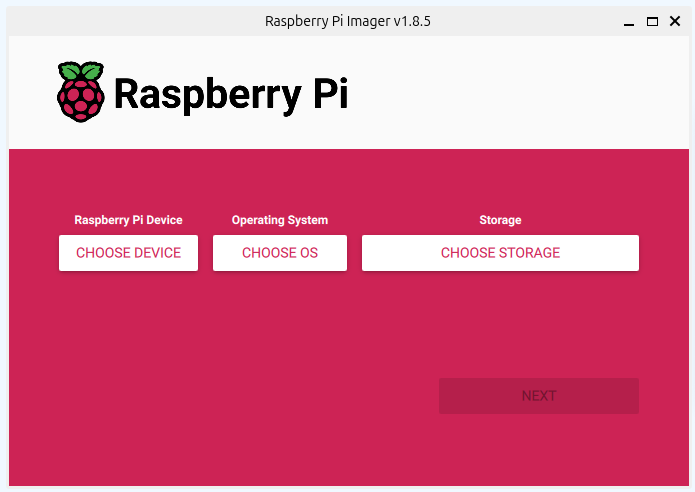
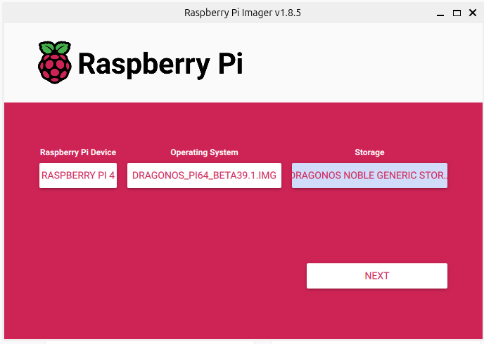
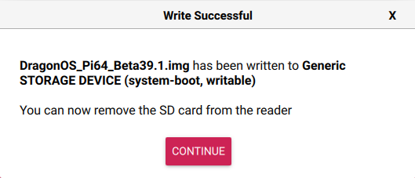

Raspberry Pi
==========================

Setting up a Raspberry Pi to use SDRs isn't much different than setting up
an SDR for Linux. However, there are a few OS's that are pre-built for
working with SDRs which saves a lot of hassle. Here are some pre-built OS
for working with SDRs.

- DragonOS_
    - Both standard OS and Raspberry Pi support
    - Basically Linux with pre-installed software for SDRs
- SigintOS_
    - Not designed for Raspberry Pi but an option for a standard OS
- PiSDR_
    - No longer under development

In this tutorial, DragonOS will be installed onto a Raspberry Pi 4B.

Many programs built into DragonOS use GUIs, so it is a good idea to
connect a screen, mouse and keyboard to the Pi once it is ready to boot up.
If that isn't an option, VNC is a good alternative as it gives
desktop control through a network connection
(although there are many options besides VNC).
There are plenty of good tutorials on setting up VNC, and DragonOS comes with
RealVNC pre-installed.

Install DragonOS
-----------------------

First DragonOS will need to be flashed to a mirco SD card.
Raspberry Pi Imager is an excellent tool for this and can be
downloaded from `the Raspberry Pi website <https://www.raspberrypi.com/software/>`_.
Download the imager and install it.
Once installed, the imager will look like this.

Download the latest version of DragonOS_.
It can be `downloaded on sourceforge <https://sourceforge.net/projects/dragonos-pi64/>`_.
The file is zipped using gz.
On Windows, it can be unzipped with 3rd party software like 7-Zip.
On Linux, it can be unzipped by opening a terminal, changing to the directory
of the file, and running:

.. code-block:: console

    gzip -d filename.gz

Unzipping will take some time as the file is a few gigabytes.

Open the Raspberry Pi Imager and select `Raspberry Pi 4`` as the `Raspberry Pi Device`.
Under `Operating System` scroll down and select `Use custom`.
Select the DragonOS file from the computers file system.
Then under `Storage`, select a connected micro SD card to flash with DragonOS.
It will look something like this when properly configured
(although the storage device name may be different).

Selecting `Next` will bring a prompt to edit OS settings.
Under OS settings, the hostname, login info, Wifi and more can be customized.
Adding wifi information will make it easier to connect to the Pi
remotely later. If you plan on using VNC, make sure to enable SSH in the `Services`
tab so that the VNC server can be started remotely. Once the settings have been
configured, apply them and close the dialog screen. It will ask to confirm that
all existing data will be erased.

.. note::

    Customizing the username and password in Raspberry Pi Imager has no effect
    when installing DragonOS; the username and password will be `ubuntu` and
    `dragon` reguardless.

The imager will then write begin writing to the micro SD card.
The process will take a few minutes, but once it is done, it will display a
message like this:

.. note::

    If there is an error saying `Partition does not have a FAT file system`
    then you may be using the wrong file for DragonOS, ensure it is a .img
    for Raspberry Pi and not a .iso file.

With the OS installed and ready, the Pi can be booted up. Connect it to a
keyboard, mouse, and monitor, or log in remotely with SSH to set VNC up.
The default username is `ubuntu` and the password is `dragon`.

.. note::

    Make sure the display is plugged into the Raspberry Pi's `HDMI0` port,
    not the `HDMI1` port, or else the login screen might not show.

To change the password after logging in, open up a terminal and run the
following command:

.. code-block:: console

    passwd

Follow the prompts to change the password of the `ubuntu` user.

If the Raspberry Pi can be logged into, setup is complete!

    

.. _DragonOS: https://cemaxecuter.com/
.. _SigintOS: https://www.sigintos.com/sigintos-2-0-community-edition/
.. _PiSDR: https://github.com/luigifcruz/pisdr-image
