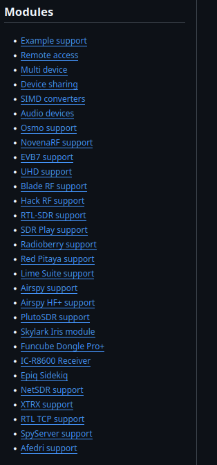

SoapySDR
==========================
`SoapySDR <https://github.com/pothosware/SoapySDR/wiki#using-soapysdr>`__
is a powerful tool by Pothosware. It enables most SDRs to be
controlled by many programming languages such as C, C++, Python and more.
Access to SDRs through a common library enables complex projects.
SoapySDR will be used in all the code-based examples.

SoapySDR has a `build guide <https://github.com/pothosware/SoapySDR/wiki/BuildGuide>`_
for setting up the library. This tutorial will walk through it for Ubuntu.

Installing Dependencies
-----------------------------
This is a simple step. Run the following commands depending on which version
of Python you are using.

Ubuntu with python2:

.. code-block:: console

    sudo apt-get install cmake g++ libpython-dev python-numpy swig

Ubuntu with python3:

.. code-block:: console

    sudo apt-get install cmake g++ libpython3-dev python3-numpy swig

Installing the Source Code
------------------------------
Clone a copy of the repository onto the computer.
Run this command from a directory that makes sense
(Downloads, Documents, Home).
The repository files can be deleted after installation is finished.

Clone the repository and enter the created directory:

.. code-block:: console

    git clone https://github.com/pothosware/SoapySDR.git
    cd SoapySDR

Now from within the repository, the files can be built
and the library installed.

.. code-block:: console

    mkdir build
    cd build
    cmake ..
    make -j`nproc`
    sudo make install -j`nproc`
    sudo ldconfig #needed on debian systems
    SoapySDRUtil --info

If the command :code:`SoapySDRUtil --info` produced an output like shown
below then the installation is complete!

.. code-block:: console

    ######################################################
    ##     Soapy SDR -- the SDR abstraction library     ##
    ######################################################

    Lib Version: v0.8.1-gfbf9f3c3
    API Version: v0.8.200
    ABI Version: v0.8-3
    Install root: /usr/local
    ...

Modules
----------------
The Setup isn't necessarily complete! The base library does
not include drivers for particular SDRs. To add support
for an SDR family, the correct module will need to be installed.
The process is fairly similar to building the base library:
cloning the module's repository, building the files, and installing them.

Available modules are listed on the `wiki, <https://github.com/pothosware/SoapySDR/wiki>`_.
A side panel in the document lists links to the available modules.

.. toctree::

    /tools/pythonSoapySDR
